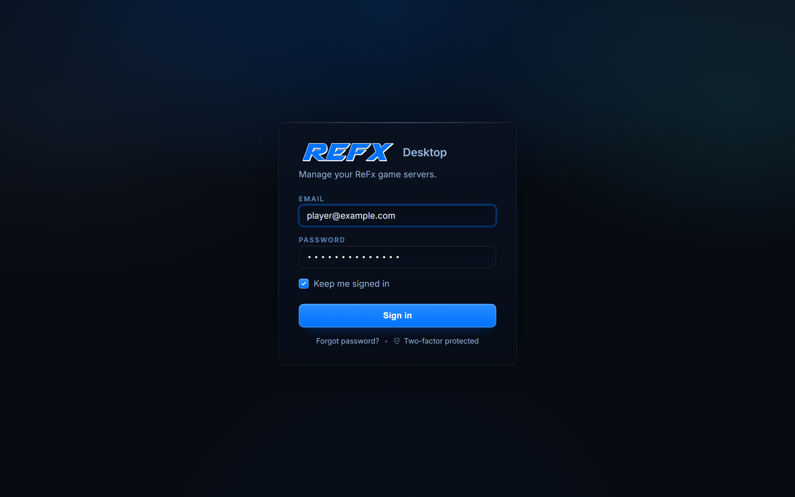
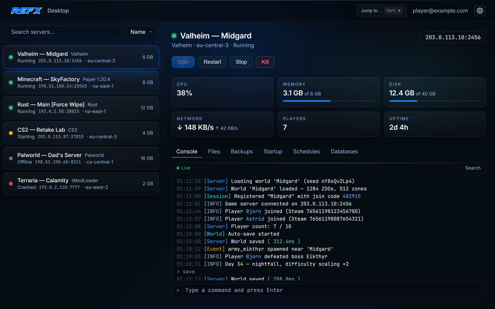

# ReFx Desktop — Feature Tour

*A screen-by-screen look at the native ReFx Hosting app for Windows.*

---

## 1. Sign in

Sign in with your ReFx Hosting account. Two-factor authentication keeps your account safe, and "Keep me signed in" remembers you securely so you don't have to log in every time. Your login is stored securely by Windows — never in a plain-text file.

---

## 2. Your servers, live

This is home base. Your servers are listed on the left — each with a live status dot (running, starting, offline, crashed), its address, region, and RAM — and the one you select opens on the right:

- **Power controls** — **Start**, **Restart**, **Stop**, and a **Kill** that asks you to confirm first. The status updates instantly, so you always know exactly where your server stands.
- **Live stats** — CPU, memory, disk, network, players online, and uptime, updated in real time.
- **Live console** — your server's real console, streamed live, with search, full scrollback, and a command line to type straight into the server. It reconnects on its own after your PC sleeps or wakes, so you never miss a line.

The tabs along the bottom switch the same panel to **Files**, **Backups**, **Startup**, **Schedules**, and **Databases**.

### Files, backups & startup

- **Files** — a file manager with a built-in code editor: browse, edit, upload, download, compress, extract, rename, and delete.
- **Backups** — create, restore, lock, and download your backups in a couple of clicks.
- **Startup, Schedules & Databases** — adjust your startup settings and launch command, set up scheduled tasks, and view your databases.

---

## 3. Crash alerts & the tray

ReFx Desktop is a real Windows app, and it keeps watching even when you're not:

- **Crash alerts** — the instant a server goes down, you get a Windows notification, even with the app minimized to the tray. And it won't cry wolf when *you're* the one restarting a server.
- **System tray** — every server with a live status dot and quick power actions, right from the tray menu.
- **Quick switch** — **Ctrl + K** jumps you to any server from anywhere in the app.
- **Start with Windows** — optionally launch ReFx Desktop when you sign in, so it's always keeping an eye on your servers.

---

## 4. Secure by design

Your account and servers are protected end to end:

| | |
|---|---|
| 🔐 **Two-factor authentication** | Protects your sign-in. |
| 🗝️ **Secure credential storage** | Your login is stored securely by Windows, never in a plain-text file. |
| 🔒 **Encrypted traffic** | Everything between the app and ReFx is encrypted. |
| ✅ **Signed updates** | Every update is cryptographically signed and verified before it installs. |

---

See the <a href="../README.md">README</a> to get started.
  
ReFx Desktop · part of the <a href="https://refx.gg">ReFx Hosting</a> platform

